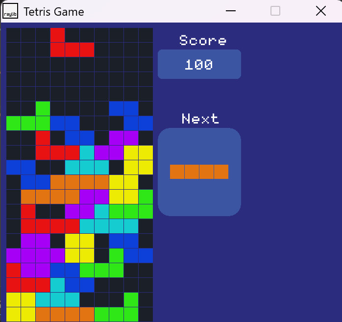

# C++ Tetris Game using raylib

Tetris Game is a classic block-stacking puzzle recreated in C++ using the raylib library.
The project focuses on building the core Tetris mechanics—piece movement, rotation, line clearing, and score tracking—while keeping the codebase clean and beginner-friendly.
It’s a great example of applying basic game loop concepts, collision detection, and rendering in C++ on Windows.

**Gameplay screenshot:**

* Open [Tetris-Game]() video to see the gameplay.
---